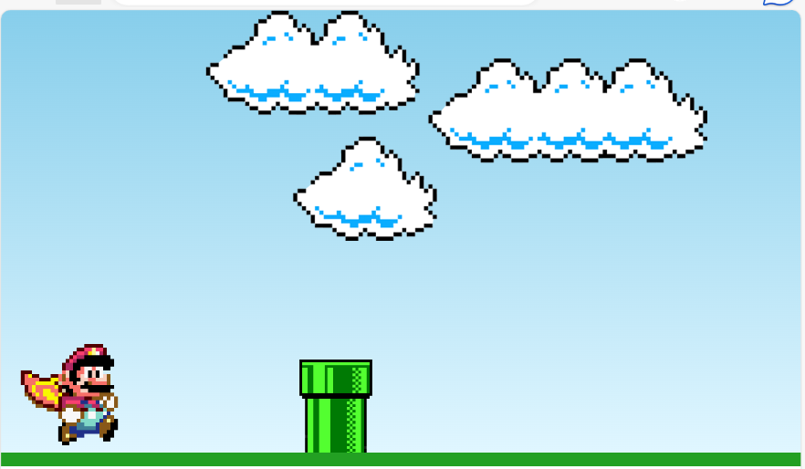

# Super Mario World Mini Jogo
Este é um mini jogo temático inspirado no Super Mario World, criado utilizando HTML, CSS e JavaScript, realizado com o objetivo de Treinar Lógica de Programação em JS. 

## Como Jogar

1. Abra o arquivo `index.html` no seu navegador para iniciar o jogo.
2. Use a tecla de espaço (barra de espaço) para fazer o Mario pular.
3. Evite colidir com os obstáculos, representados por canos.
4. Tente chegar o mais longe possível sem colidir.

## Tecnologias Utilizadas

 
  
  
  

Este projeto utiliza as tecnologias mencionadas acima para criar uma experiência de jogo inspirada no Super Mario World.

## Demonstração
Esta imagem demonstra o jogo que foi criado neste projeto.

